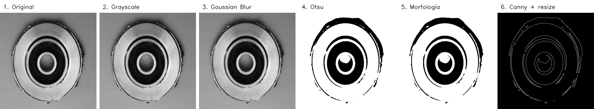
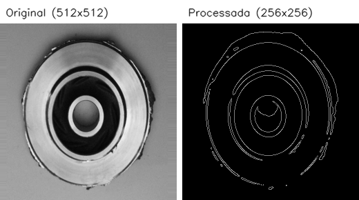
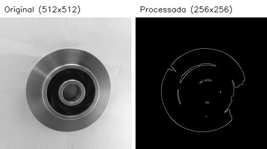

# Mini-Projeto - Pré-processamento de Imagens com OpenCV

Pipeline em Python para pré-processar imagens de peças de fundição.

## Objetivo

Padronizar um lote de imagens de peças metálicas com OpenCV, destacando contornos e marcas das peças.

O objetivo não é dizer se a peça tem defeito ou não. A ideia é preparar as imagens para uma etapa futura de Machine Learning. No final, cada saída vira um mapa de bordas em 256x256 pixels, mantendo a pasta da classe (`def_front` / `ok_front`).

## Planejamento

O trabalho foi dividido em seis sprints, seguindo o enunciado do projeto. Cada sprint foi feita em uma branch `feature/*` e depois enviada por Pull Request para a branch `development`:

| Sprint | Entrega |
| --- | --- |
| 1 | Repositório, branch `development`, ambiente virtual e download do dataset |
| 2 | Estrutura de pastas e leitura das imagens em lote |
| 3 | Escala de cinza e suavização |
| 4 | Limiarização e detecção de bordas |
| 5 | Refinamento morfológico e padronização de tamanho |
| 6 | Documentação |

A separação em módulos começou na sprint 2: `src/loader.py` ficou com a leitura e gravação das imagens, e `src/preprocess.py` ficou com as transformações.

## Estrutura

```
.
├── main.py
├── requirements.txt
├── LICENSE
├── docs/
│   └── assets/
├── raw_images/
├── processed_images/
└── src/
    ├── loader.py
    └── preprocess.py
```

`raw_images/` recebe as imagens originais e `processed_images/` recebe as imagens processadas.

## Dataset

O projeto usa o dataset público *Casting Product Image Data for Quality Inspection*. Há duas opções de download:

- **Google Drive** (disponibilizado pelo professor): https://drive.google.com/file/d/1K5gNxQ7RXA-nb4boNzPYQTJlRvJyYBD1/view?usp=sharing
- **Kaggle** (fonte original): https://www.kaggle.com/datasets/ravirajsinh45/real-life-industrial-dataset-of-casting-product

O arquivo do Drive descompacta em `casting_512x512/def_front` e `casting_512x512/ok_front`. No Kaggle, usar o mesmo conjunto de 512x512 (o download exige conta e inclui outras variações do dataset, não usadas aqui).

Em ambos os casos, copiar as pastas `def_front` e `ok_front` para `raw_images/`, ficando assim:

```
raw_images/
├── def_front/
└── ok_front/
```

Importante: As imagens do dataset não foram adicionadas ao repositório.

## Etapas do pipeline

O script aplica as seguintes etapas:

1. Leitura das imagens em lote;
2. Conversão para escala de cinza;
3. Suavização com Gaussian Blur;
4. Limiarização com Otsu;
5. Refinamento com operação morfológica;
6. Detecção de bordas com Canny;
7. Redimensionamento para 256x256 pixels.

Cada etapa aplicada sobre a mesma peça:



A conversão para escala de cinza simplifica a imagem antes dos filtros. Depois disso, o Gaussian Blur reduz ruídos, o Otsu gera uma máscara binária, a morfologia limpa pequenos pontos isolados, o Canny destaca as bordas e o resize deixa todas as saídas no mesmo tamanho.

## Como executar

Criar o ambiente virtual e instalar as dependências:

```bash
python3 -m venv .venv
source .venv/bin/activate
pip install -r requirements.txt
```

Executar o pipeline:

```bash
python main.py
```

O script lê as imagens de `raw_images/` em lote e grava o resultado em `processed_images/`.

## Demonstração

Saída do pipeline processando o dataset completo:

```
Diretório de entrada: raw_images/
Diretório de saída: processed_images/
Arquivos de imagem encontrados: 1300
Imagens processadas: 1300
Arquivos ignorados: 0
Etapas aplicadas: grayscale, blur, Otsu, morfologia, Canny e resize
Distribuição por classe:
  def_front: 781
  ok_front: 519
```

Peça com defeito (`def_front`):



Peça sem defeito (`ok_front`):



Comparando as imagens, dá para perceber que o resultado deixa os contornos mais visíveis. Nas peças com defeito aparecem mais irregularidades, o que pode ajudar em uma etapa futura de classificação.

## Branches

- `feature/sprint1-setup-ambiente`: configuração inicial do projeto.
- `feature/sprint2-leitura-em-lote`: estrutura de pastas e leitura em lote.
- `feature/sprint3-pipeline-preprocessamento`: escala de cinza e blur.
- `feature/sprint4-segmentacao-bordas`: Otsu e Canny.
- `feature/sprint5-refinamento-padronizacao`: morfologia e resize.
- `feature/sprint6-documentacao-final`: documentação final.

## Possíveis melhorias

- Testar outros filtros e valores de limiar.
- Comparar visualmente os resultados com imagens de diferentes classes.
- Usar o pipeline como entrada para um modelo de Machine Learning.

## Licença

[MIT](LICENSE.md).
